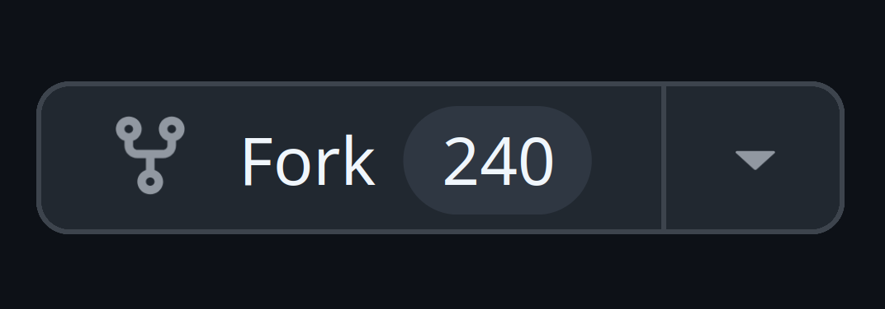
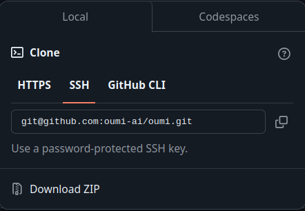

# Documento en Markdown

Escape de caracter con \

- [Documento en Markdown](#documento-en-markdown)
  - [Texto](#texto)
  - [Listas](#listas)
  - [Otras](#otras)
  - [Externo](#externo)
  - [Codigo](#codigo)
  - [Tablas](#tablas)
- [Task List](#task-list)
- [Emoji](#emoji)
- [Comentarios](#comentarios)
- [Toggle](#toggle)
  - [Avisos](#avisos)


## Texto

**Pueden ser * o _**

*Texto en cursiva*

**Negritas**

***Negritas en cursiva***

~~tachado~~

## Listas

**Se puede usar +,-,\* o numeros**
* Lista
    * Lista

**Los numeros solo se anidan con espacios**
1. Lista  
    2. Lista

Mezcladas

1. Inicio
    * Elemento 1.1
2. Conclusion
    * Elemento 2.1
3. Final
    * Elemento 3.1

## Otras

Estas lineas tambien puede ser * o _
***

> Esto es una cita

## Externo

Links
[Youtube ;)](www.youtube.com "cliquea aqui")

Variables
[Facebook][miLink]

[miLink]: https://www.facebook.com "Hora de stalkear"

___
Imagen



[](https://www.github.com)

## Codigo

`Codigo: print("Hola")`

```py
def saludar():
    print("Hola")
    return 0
```

## Tablas
| Columna1 | Columna2 | Columna3 |
|   :---   |  :---:   |   ---:   |
|  txtIzq  |txtCentro |  txtDer  |

# Task List
- [x] Cumplido  
- [ ] No cumplido

# Emoji
Este es un emoji :joy:

# Comentarios
Abajo de esto hay un comentario

[Comentario]: #

# Toggle

<details>
    <summary>Haz click aqui</summary>
    Sorpresa
</details>

## Avisos

> :bulb: **Nota:** No se que poner la vdd  
