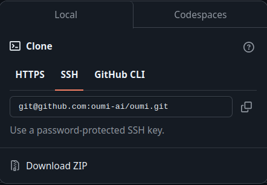

# Guia de Git y Github

Nota: En Markdown.md puedes encontrar una guia rapida de comandos de markdown
- [Guia de Git y Github](#guia-de-git-y-github)
  - [Git](#git)
    - [Mis comandos](#mis-comandos)
    - [Importantes basicos](#importantes-basicos)
    - [Importantes](#importantes)
    - [Remoto](#remoto)
    - [Archivos git](#archivos-git)
    - [Faltante de agregar](#faltante-de-agregar)
  - [Github](#github)

## Git

Seccion con comandos e instrucciones sobre git

### Mis comandos
**Stash**
- `git showstash` = git stash --list --decorate
  
**Configuracion**
- `git conf` = git config --global -e  
  
**Log**
- `git lg` = log formateado con graph, una linea y colores agradables

**Status**
- `git st` = status --short
  
### Importantes basicos

- **Iniciales**
  - `git init` = Crea el repositorio local
  - `git log` = Registro de los commits
  - `git status` = Estado del repositorio
  - `git add example.py` = Añade el archivo example al stage
  - `git init` = Crea el repositorio local
- **Modificadores**
  - `.` = Todo
  - `*.py` = Todos los archivos .py
  - `media/` = Todos los archivos de la carpeta media
- **Configuracion**
  - `git config --global -e` = Abre el archivo de configuracion global
    
  
### Importantes

- **Ammend**
  - `git commit --ammend -m "Hola"` = Modifica el ultimo commit(Y manda los archivos del stage en la modificacion)
  
- **Stash**
  - `git stash` = stash  
    `git stash apply` = aplica el stash  
    `git stash pop` = aplica el stash y lo borra  
    `git stash drop` = borra el stash  

- **Reflog**
  - `git reflog` = Registro de los HEAD 

- **Reset:**
  - `--soft` = No cambia el stage ni el directorio
  - `--mixed` = Vacia el stage
  - `--hard` = Vacia el stage y el directorio

- **Tag**
  - `git tag etiqueta hashCommit`

- **Ramas**
  - `gti branch -d mirama` = Eliminar ramas
  - `git branch -M main` = Cambia el nombre de la rama actual, -M la forza y -m lo intenta
  - `git merge`: Aplica los cambios de una rama en la otra y preserva el historial de ambas
  - `git rebase`: Reaplica los commits de una rama sobre otra y limpia el historial
  - `git squash`: Combina varios commits en uno solo para un historial más limpio (`git rebase -i`).

### Remoto
- **Fetch**  
  - `git fetch aliasRepo rama` = Descarga los cambios del repositorio pero no los aplica automaticamente
  
- **Pull**  
  - `git pull aliasRepo rama` = Descraga y aplica los cambios del repositorio

- **Push**
  - `git push -u aliasRepo main` = Primer push de la rama(-u establece la relación de seguimiento)
  - `git push aliasRepo rama` = Mandar al repositorio remoto

- **Configuraciones**
  - `git remote -v` = Ver los remotos del repositorio
  - `git remote rename alias aliasNuevo` = Cambia el nombre del alias de "alias" a "aliasNuevo"
  - `git remote remove aliasRepo` = Ellimina el alias "aliasRepo"
  - `git remote add aliasRepo https://github.com/usuario/repositorio.git` = Conecta el repositorio actual con uno remoto  
  Nota: Se pueden crear varios alias para el mismo repositorio(Poco util), o crear varios alias para diferentes repositorios(util si alojamos nuestro proyecto en varias plataformas, como github y gitlab)

### Archivos git
  - `.gitkeep` = Le dice a github que necesitamos que trackee la carpeta en la que esta almacenado (Util cuando esta vacia, ya que git las ignora)  
  - `.gitignore` = Dentro de este archivo podemos escribir que cosas queremos que git ignore, como por ejemplo la carpeta DS_STORE para desarrolladores de mac, o los logs de debug de algun archivo  

```js
#.gitignore para archivos de texto excepto uno llamado hola.txt
*.txt
!hola.txt

#Ignorar carpeta fotos(y su contenido)
fotos/

Ignorar los .txt que terminen en ), como hola(copia2).txt
*).txt
```
  
### Faltante de agregar
- git revert
- git rebase

## Github
Seccion con comandos e instrucciones sobre git

- Fork: Clona el repositorio en tu cuenta
  
   

- Code: Te da el codigo para clonar el repositorio
  - Nota: Es preferible con SSH  
  
   

- Pull request(PR): Despues de hacer un fork y modificar algo, puedes hacer un PR para solicitar al dueño del repositorio original que añada tu cambio